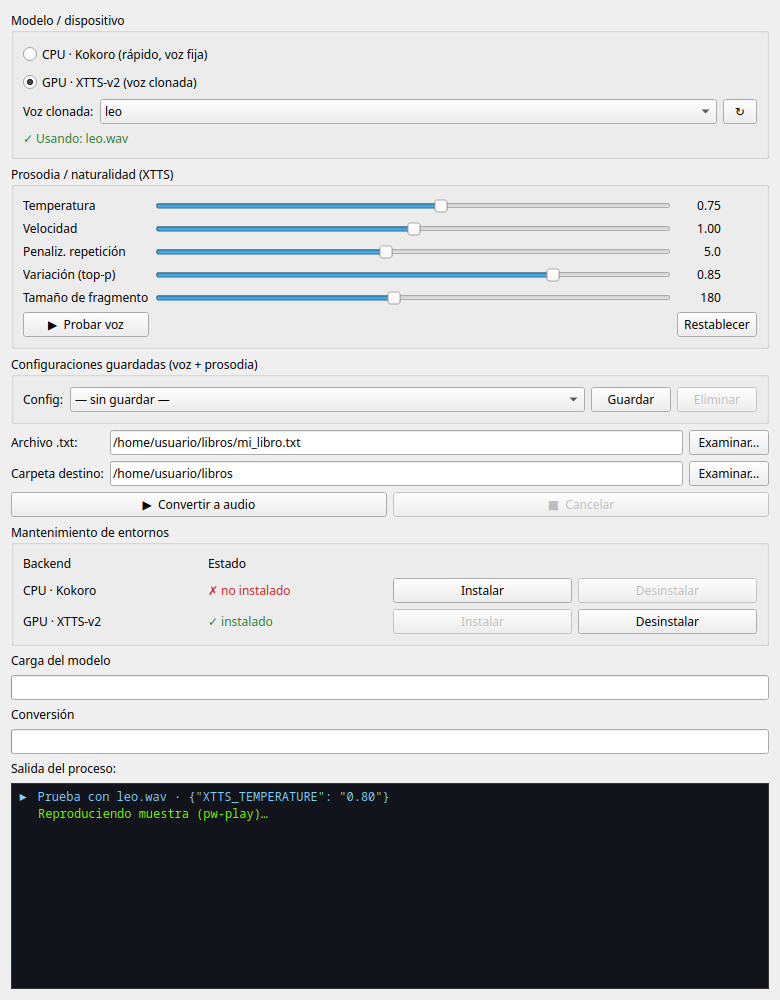

# Libre_audioBooks (xtts + voice_clone)

**Convierte texto (`.txt` / `.epub`) en audiolibros**, leídos con **tu propia voz
clonada** (XTTS-v2 en GPU) o con una voz fija rápida (Kokoro en CPU). Incluye una
**GUI nativa Qt6/Wayland** con vista previa instantánea, control de prosodia y
gestión de configuraciones de voz.

Pensado para español, pero XTTS-v2 es multilingüe.



---

## ✨ Características

- **Dos motores de síntesis**, cada uno en su propio entorno:
  - **GPU · XTTS-v2** — clona una voz a partir de muestras tuyas (requiere CUDA).
  - **CPU · Kokoro** — voz fija española (`ef_dora`), rápida, sin GPU.
- **GUI** (`gui.py`): selector de modelo, selección de voz, conversión con dos
  barras de progreso y terminal en vivo.
- **Prosodia ajustable** con deslizadores: temperatura, velocidad, penalización de
  repetición, variación (top-p) y tamaño de fragmento.
- **Prueba de voz instantánea** (`▶ Probar voz`): un *worker* XTTS residente
  mantiene el modelo en memoria → la 1ª prueba carga el modelo (~17 s) y las
  siguientes tardan **~1 s**.
- **Configuraciones guardadas**: guarda/recupera/elimina combinaciones de voz +
  prosodia.
- **Herramientas de clonación de voz**: grabador guiado y conversor/mezclador de
  muestras a `.wav` 24 kHz mono limpio.
- **Conversión de EPUB a texto** (`epub_to_tts.py`) y lanzadores `.desktop`.

> 🔒 **Las voces clonadas NO se versionan.** El repo incluye solo las
> *herramientas* para crearlas; tus muestras de audio se quedan en tu equipo.

---

## 🧩 Dependencias y créditos

Este proyecto se apoya en software libre excelente:

| Componente | Uso | Repositorio / paquete |
|---|---|---|
| **Coqui XTTS-v2** | Clonado de voz (GPU) | [`coqui-tts`](https://github.com/idiap/coqui-ai-TTS) (fork mantenido por Idiap del [Coqui TTS](https://github.com/coqui-ai/TTS) original) |
| **Kokoro** | Voz fija CPU | [`kokoro`](https://github.com/hexgrad/kokoro) |
| **PyTorch / torchaudio** | Backend de cómputo | [pytorch.org](https://pytorch.org) |
| **PySide6 (Qt for Python)** | Interfaz gráfica | [Qt for Python](https://doc.qt.io/qtforpython/) |
| **EbookLib + BeautifulSoup** | Lectura de EPUB | [EbookLib](https://github.com/aerkalov/ebooklib), [bs4](https://www.crummy.com/software/BeautifulSoup/) |
| **soundfile / NumPy** | E/S y proceso de audio | [python-soundfile](https://github.com/bastibe/python-soundfile), [NumPy](https://numpy.org) |
| **espeak-ng / phonemizer** | Fonemización (Kokoro) | [espeak-ng](https://github.com/espeak-ng/espeak-ng) |
| **ffmpeg** | Limpieza/mezcla de muestras | [ffmpeg.org](https://ffmpeg.org) (binario del sistema) |

Las versiones exactas están fijadas en `requirements-cpu.txt` y
`requirements-gpu.txt`.

### Licencias de terceros (importante)

- El **modelo XTTS-v2** se distribuye bajo la **[Coqui Public Model License (CPML)](https://coqui.ai/cpml)** — **uso no comercial**. Al usarlo aceptas sus términos (la app exporta `COQUI_TOS_AGREED=1`).
- **Kokoro** y sus pesos: licencia Apache-2.0.
- El **código de este proyecto** se publica bajo licencia MIT (ver `LICENSE`).

---

## 📦 Instalación

Requisitos del sistema: **Python 3.11**, `ffmpeg`, y para el modo GPU una tarjeta
**NVIDIA con CUDA 12.4**. En Fedora/Nobara:

```bash
sudo dnf install python3.11 ffmpeg espeak-ng
```

### 1. Instalación inicial — solo la GUI

Lo único necesario para arrancar es un entorno base ligero (PySide6). **Los
motores de síntesis NO se instalan aquí**: se descargan bajo demanda desde la
propia interfaz.

```bash
python3.11 -m venv venv_gui
source venv_gui/bin/activate
pip install -r requirements-gui.txt
deactivate

./xtts_gui.sh          # abre la GUI
```

### 2. Instalar el motor de voz desde la GUI

En la sección **Modelo / dispositivo**, al elegir un backend que aún no está
instalado, la GUI te ofrece **instalarlo en ese momento**. También puedes usar
los botones **Instalar / Desinstalar** de la sección *Mantenimiento de entornos*:

- **GPU · XTTS-v2** → crea `venv_xtts/` con `requirements-gpu.txt` (PyTorch CUDA 12.4).
- **CPU · Kokoro** → crea `venv/` con `requirements-cpu.txt` (PyTorch CPU).

Internamente esto ejecuta `install_backend.sh`, que crea el venv correcto e
instala el PyTorch y las dependencias adecuadas según el backend.

> Cada backend vive en su **propio entorno**, independiente y no intercambiable
> (las versiones de `torch` y `transformers` chocan entre sí). El de la GUI
> (`venv_gui`) es aparte y mínimo.

### Instalación manual (opcional, sin GUI)

```bash
./install_backend.sh gpu     # XTTS-v2 (voz clonada) → venv_xtts/
./install_backend.sh cpu     # Kokoro (voz fija)     → venv/
```

Cada `requirements-*.txt` lleva además las instrucciones detalladas en su
cabecera; el `requirements.txt` raíz es solo un índice explicativo.

---

## 🚀 Uso

### GUI (recomendado)

```bash
./xtts_gui.sh        # lanza gui.py en Wayland nativo con venv_xtts
```

1. Elige el backend (CPU o GPU).
2. En GPU, elige la voz clonada y ajusta la prosodia con los deslizadores.
3. Pulsa **▶ Probar voz** para oír una frase de muestra con esos ajustes.
4. Selecciona el `.txt` y la carpeta de destino, y pulsa **Convertir a audio**.

### Línea de comandos

```bash
# Voz clonada (GPU):
venv_xtts/bin/python audiobook_xtts.py entrada.txt salida.wav voz_clonada/clonada.wav

# Voz fija (CPU/Kokoro):
venv/bin/python audiobook.py entrada.txt salida.wav
```

Parámetros de prosodia por variable de entorno (los mismos que los deslizadores):

```bash
XTTS_TEMPERATURE=0.8 XTTS_SPEED=0.97 XTTS_REPETITION_PENALTY=5 \
XTTS_TOP_P=0.85 XTTS_MAX_CHARS=180 \
venv_xtts/bin/python audiobook_xtts.py libro.txt libro.wav voz_clonada/clonada.wav
```

### EPUB → texto

```bash
venv/bin/python epub_to_tts.py libro.epub libro.txt
```

### Lanzadores de escritorio

Los `.desktop` permiten arrastrar archivos. **Edita las rutas absolutas** dentro
de cada `.desktop` para que apunten a tu ubicación del proyecto.

---

## 🎙️ Clonar tu voz (paso a paso)

El objetivo es obtener un `voz_clonada/clonada.wav` **limpio** (mono, 24 kHz, sin
saturación). La calidad de esta muestra es el **factor nº1** para que el clon
suene natural.

**Opción A — grabar desde cero:**

```bash
./voz_clonada/grabar_muestras.sh
```

Te guía con textos (`GUION_LECTURA.txt`), graba varias tomas y las une.

**Opción B — partir de audios que ya tienes:**

```bash
# Un archivo → un .wav limpio:
./voz_clonada/a_wav.sh entrevista.mp3

# Varios archivos → se ORDENAN por su número (1,2,3…) y se UNEN en uno solo:
./voz_clonada/a_wav.sh toma1.ogg toma2.ogg toma3.ogg
```

`a_wav.sh` aplica `highpass + reducción de ruido + loudnorm` y normaliza a 24 kHz
mono. Renombra el resultado a `clonada.wav` para usarlo como voz por defecto, o
elígelo desde la GUI.

**Consejos:** sala en silencio, micro a distancia constante, **30–60 s** de habla
con entonación variada (afirmaciones, una pregunta, una exclamación), ritmo de
narrador. Puedes añadir varias tomas de la *misma* voz como `clonada_2.wav`,
`clonada_3.wav`: se analizan todas juntas.

---

## 🎚️ Ajustes de prosodia

| Deslizador | Variable | Efecto |
|---|---|---|
| Temperatura | `XTTS_TEMPERATURE` | Expresividad. Baja = monótona/robótica; alta = más viva (y variable). |
| Velocidad | `XTTS_SPEED` | Ritmo del habla sin cambiar el tono. <1 = más calmado. |
| Penaliz. repetición | `XTTS_REPETITION_PENALTY` | Súbela si "tartamudea" o alarga sílabas. |
| Variación (top-p) | `XTTS_TOP_P` | Variedad de entonación entre frases. |
| Tamaño de fragmento | `XTTS_MAX_CHARS` | Más corto = menos artefactos; demasiado corto rompe la prosodia (~150–220). |

Para narración cálida suele ir bien `temperatura≈0.8`, `velocidad≈0.97`,
`penalización≈5`, `variación≈0.85`. La referencia analiza el audio **completo**
por defecto (`XTTS_GPT_COND_LEN=0`).

---

## 🗂️ Estructura del proyecto

```
gui.py               GUI Qt6 (selector, prosodia, presets, previews, mantenimiento)
audiobook_xtts.py    Síntesis con XTTS-v2 (voz clonada, GPU)
audiobook.py         Síntesis con Kokoro (voz fija, CPU)
xtts_worker.py       Worker XTTS residente para previews rápidas
epub_to_tts.py       Conversión EPUB → texto
voz_clonada/         Herramientas de grabación/limpieza de voz (sin audios)
  ├─ grabar_muestras.sh   Grabador guiado
  ├─ a_wav.sh             Conversor/mezclador a .wav 24 kHz mono
  └─ GUION_LECTURA.txt    Textos para las tomas
install_backend.sh   Crea e instala un backend (cpu|gpu) en su venv
requirements-gui.txt Entorno base mínimo para la GUI (venv_gui)
requirements-gpu.txt Dependencias del entorno XTTS (venv_xtts)
requirements-cpu.txt Dependencias del entorno Kokoro (venv)
docs/gui.png         Captura de la interfaz
*.sh / *.desktop     Lanzadores
```

---

## 📝 Licencia

Código del proyecto: **MIT** (ver `LICENSE`). Los modelos de terceros conservan
sus propias licencias (XTTS-v2: CPML, no comercial · Kokoro: Apache-2.0).
